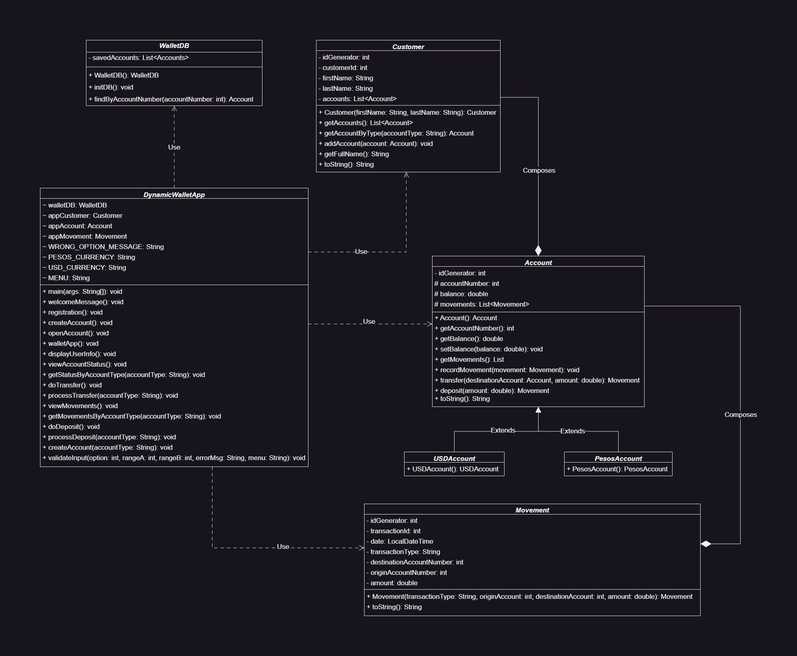

# Proyecto Integrador
Proyecto integrador desarrollado por el equipo _DynamicDevs_. El proyecto conciste en una billetera virtual que permita registro de usuarios, creación y control de cuentas bancarias, permitiendo al usuario elegir entre cuentas en Pesos o en USD.

## Instrucciones para los desarrolladores:
- Clonar el repositorio con uno de los siguientes comandos:
> Opción HTTPS <br> `git clone https://github.com/PowerSystem2024/proyecto-2do-semestre-dynamicdevs.git`

> Opción SSH <br> `git clone git@github.com:PowerSystem2024/proyecto-2do-semestre-dynamicdevs.git`

- El proyecto contiene la siguiente estructura de carpetas:
```
dynamic-wallet
├── src
│   ├── domain
│   └── repository
```
- Para trabajar, crear las clases/entidades dentro de la carpeta `domain` y la clase relacionada a la base de datos en `repository`
- Las ramas están compuestas por la rama principal, la rama dev y desde ésta última nacen las demás ramas
- Cada rama de cada participante contiene el siguiente formato: nombre-apellido. Por lo tanto se deben mover a la rama propia con el siguiente código (nombre de ejemplo):
> `git checkout john-doe`
- Antes de comenzar a trabajar, siempre moverse a su rama primero.
- Ya en tu rama, actualizar la rama bajando los cambios que contiene la rama `dev` utilizando el siguiente código:
> `git pull origin dev`
- Completada la funcionalidad, pushear el código a la rama que contiene tu nombre, que fue en la que trabajaste, ejemplo:
> `git push origin john-doe`
- Ir a GitHub y levantar una petición de fusión de ramas (Pull Request). La petición debe ser la fusión de la rama que contiene tu nombre hacia la rama dev (_john-doe -> dev_)
- Una vez creada la PR (pull request), asignar la revisión de dicha PR a Héctor Cortez.

## Importante
Actualizar tu rama es crucial y siempre tiene que ser lo primero a realizar antes de realizar código.

Se tiene que recordar que las PR se realizan únicamente a la rama `dev`, por lo tanto se debe prestar mucha atención porque se puede realizar una petición a una rama erronea.

## Diagrama de Clases
El diagrama lo pueden encontrar dentro de la carpeta raíz del proyecto: `dynamic-wallet`. Consultarlo las veces que sea necesario como referencia.



## Requetimientos Funcionales
Consultar el documento adjunto llamado `requerimientos_dynamic_wallet.pdf` para saber qué debe realizar la app.

[Documento de requisitos funcionales de la aplicación](requerimientos_dynamic_wallet.pdf)